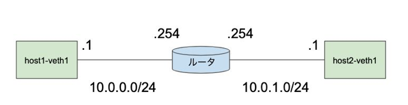

## ## The book

https://www.amazon.co.jp/gp/product/B09FG2SL2S

## ## 作成物(ToyTCP) → [RFC793](https://datatracker.ietf.org/doc/html/rfc793)に緩く従ったTCPの実装

### ### 実装する機能

> * listen, accept, connect, send, recv, close といった基本的なAPI
> * 再送制御
> * 順序制御
> * スライディングウィンドウ

### ### 制約・実装"しない"機能

> * IPv4のみ対応
> * RSTセグメントを扱わない(下記参照)
> * 再送タイムアウト時間(RTO)は固定
> * ウィンドウサイズは固定
>   * 輻輳制御は行わない
>   * フロー制御は行わない
> * TCPオプションは利用しない
> * 不測の事態(突然ホストがクラッシュする等)には対応しない
> * セキュリティ関連を扱わない
> * 同じホスト上でToyTCPとOSのTCPを同時に混ぜて使うことはできない
>   * ToyTCPでの実験中はOSのTCPは利用しない(ポートをあけたりしない)

## ## Network 環境 (書籍 第2章)

### ### 構築セットアップスクリプト

[./setup.sh](./setup.sh)

### ### 構築されるネットワーク図



### ### カーネルのプロトコルスタックのTCP処理とToyTCPが競合する問題の対応

OSのTCP処理がSYNに対してRSTを返すことでToyTCPが動かない問題になる。

これを回避するために全てのRSTセグメントをiptablesで破棄するというやや強引な方法を取るとのこと。

[./setup.sh](./setup.sh)の以下の箇所でその設定をしている。

```sh
# drop RST
sudo ip netns exec host1 sudo iptables -A OUTPUT -p tcp --tcp-flags RST RST -j DROP
sudo ip netns exec host2 sudo iptables -A OUTPUT -p tcp --tcp-flags RST RST -j DROP
```

### ### NICがチェックサム処理を肩代わりする(オフロード)機能を無効にする

TCPにはセグメントの破損を検出するチェックサムフィールドがあるが、CPUリソース節約のためにNICにオフロード(NICが代わりに処理する)されることがある。

ToyTCPを実装するにあたってこの機能がONだと面倒になることがあるとのことでOFFにしている。

[./setup.sh](./setup.sh)の以下の箇所でその設定をしている。

```sh
# turn off checksum offloading
sudo ip netns exec host2 sudo ethtool -K host2-veth1 tx off
sudo ip netns exec host1 sudo ethtool -K host1-veth1 tx off
```

##  TCPの課題 と QUICでの解決方法

### 課題 HoLブロッキング

ざっくり説明 → Webの文脈にて、画像ファイル・JSファイルが同じコネクションで送られるので、画像ファイル取得での通信不具合がJSファイルに影響してしまう。

#### QUICの解決案 → ストリームという単位を持つ

コネクションの中にデータフロー(Web文脈ではコンテンツ)ごとの「ストリーム」という単位を持たせることでコンテンツを独立してやり取りすることができる。


### 課題 再送時にシーケンス番号を使い回す

ざっくり説明 → TCPではPayloadのカーソル位置をベースにパケットロス時のリカバリをしている。このことにより、再送するときの指定のカーソルが同じであるため、ACKが返ったときにオリジナルのパケットの応答なのか再送時のパケットの応答なのかがわからない。そのため、RTT(ラウンドトリップ時間)を正しく推定できず性能に影響が出てしまう。

#### QUICの解決案 → パケットナンバーを導入しパケット自体を一意にする

QUICパケットの送信を行う際は、再送かどうかに関係なくパケットナンバーを加算させる。

